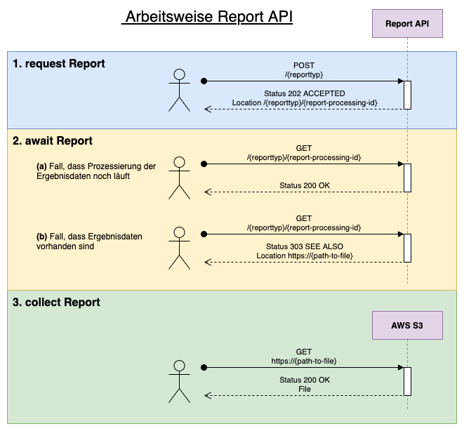

# Report API

Die Report API bietet die Möglichkeit Reportanfragen an Europace zu stellen.

Die Bearbeitung der Reportanfragen erfolgt asynchron, wodurch Requests nur eine kurze Laufzeit haben. Auf die Fertigstellung des Reports muss jedoch aktiv getestet werden.

Die OpenAPI-Dokumentation findet sich unter [https://report.api.europace.de/documentation](https://report.api.europace.de/documentation)  

## Inhalt

* [Reportantypen](#reporttypen)
* [Arbeitsweise](#arbeitsweise)
* [1. request Report](#1-request-report)
  + [Rohdaten-Report](#rohdaten-report)
    - [Anforderungen](#anforderungen)
    - [Beispiel](#beispiel)
  + [Produktanbieter-Report](#produktanbieter-report)
    - [Anforderungen](#anforderungen-1)
    - [Beispiel](#beispiel-1)
* [2. await Report (gültig für alle Reporttypen)](#2-await-report-gultig-fur-alle-reporttypen)
  + [Beispiel](#beispiel-2)
* [3. collect Report](#3-collect-report)

## Reporttypen

Derzeit sind folgende Reporttypen angebunden:
* [Rohdaten](#rohdaten-report)
* [Produktanbieter](#produktanbieter-report) (:construction:)

## Arbeitsweise

Die Arbeitsweise ist bei allen angebundenen Reporttypen dieselbe: 

1. request Report
2. await Report
3. collect Report



## 1. request Report

### Rohdaten-Report

#### Anforderungen

* Das OAuth2 Token benötigt den Scope `reporting:rohdaten:lesen`
* Das Token muss auf die angefragte `partnerId` zugreifen dürfen (Hierarchie der Plakette)

#### Beispiel

Request:

```
POST https://report.api.europace.de/rohdaten

Header:
  * Authentication: "Bearer {token}"
  * Content-Type: "application/json"
  * Trace-Id: "{traceId}" (Optional)

Body:
{
    "partnerId": "ABC12",
    "fromDay": "2020-10-01"
}
``` 

Response:

```
Header:
  * Status: 202 ACCEPTED
  * Location: /rohdaten/{report-processing-id}
```

Die ausgegebene `Location` zeigt auf den Endpunkt um nach den Ergebnisdaten anzufragen.

### Produktanbieter-Report

:construction: Work in Progress

#### Anforderungen

* Das OAuth2 Token benötigt den Scope `reporting:produktanbieterreport:lesen`
* Übernahmerecht auf den Produktanbeiter muss im OAuth2 Token abgebildet sein

#### Beispiel

Request:

```
POST https://report.api.europace.de/produktanbieter

Header:
  * Authentication: "Bearer {token}"
  * Content-Type: "application/json"
  * Trace-Id: "{traceId}" (Optional)

Body:
{
    "partnerId": "ABC12",
    "targetPartnerId": "XYZ66"
}
``` 

Response:

```
Header:
  * Status: 202 ACCEPTED
  * Location: /produktanbeiter/{report-processing-id}
```

Die ausgegebene `Location` zeigt auf den Endpunkt um nach den Ergebnisdaten anzufragen.

## 2. await Report

Dieser Schritt ist für alle Reporttypen gleich.

### Beispiel

Request:

```
GET https://report.api.europace.de/{reporttyp}/{report-processing-id}

Header:
  * Authentication: "Bearer {token}"
  * Trace-Id: "{traceId}" (Optional)
```

(a) Response für Fall, dass Prozessierung der Ergebnisdaten noch läuft

```
Header:
  * Status: 200 OK

Body:
{
  "status": "PROCESSING"
}
```

(b) Response für Fall, dass Ergebnisdaten vorhanden sind. Die ausgegebene `Location` zeigt auf die Ergebnisdaten

```
Header:
  * Status: 303 SEE OTHER
  * Location: https://{path-to-file}
```

## 3. collect Report

Dieser Schritt ist für alle Reporttypen gleich.

Die URL, welche auf die Ergebnisdaten zeigt ist nur für einen begrenzten Zeitraum gültig. Jeder, der diese URL besitzt kann auf den Report zugreifen.

Derzeit werden die Ergebnisdaten auf ein AWS S3 Bucket abgelegt. Eine URL sieht dann bspw folgendermaßen aussehen:

```
https://greta-462912489437-eu-central-1.s3.amazonaws.com/prod/{reporttyp}/{report-processing-id}/Ep2_Reports_....zip?X-Amz-Security-Token=...&X-Amz-Signature=...
```

Request:

```
GET https://greta-462912489437-eu-central-1.s3.amazonaws.com/prod/{reporttyp}/{report-processing-id}/Ep2_Reports_....zip?X-Amz-Security-Token=...&X-Amz-Signature=...
```

Response:

```
Header:
  * Status: 200 OK

Body:
<File>
```
